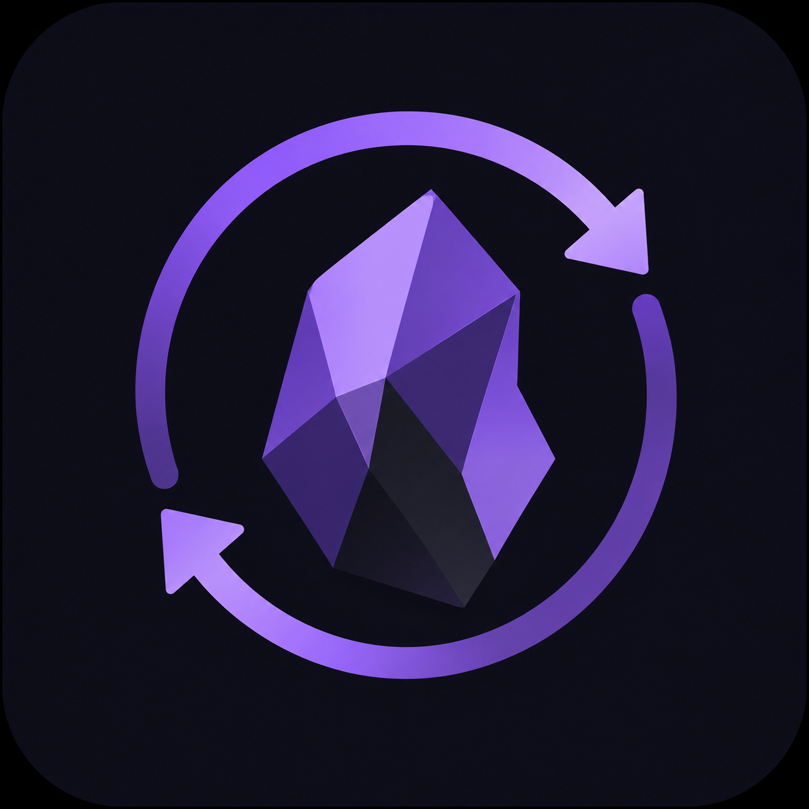

# Syncer



Syncer строит безопасное одностороннее зеркало удалённой папки в локальном Obsidian vault:
`Remote -> Local`. Приоритет — Obsidian Mobile на iOS. Первый backend — Яндекс Диск; WebDAV для
UGREEN NAS появится позже.

> Синхронизация не является резервным копированием. Перед первым использованием сделайте независимую
> резервную копию.

## Current release: v0.8.0

Работают OAuth confirmation-code + PKCE без client secret, проверка подключения, выбор существующей
папки, рекурсивный индекс Яндекс Диска со всей пагинацией, retry/Retry-After/timeout/отмена и
реальный dry run относительно текущего vault. v0.3 добавляет полный мобильный отчёт: сводку,
download bytes, списки новых/изменённых/удаляемых/пропущенных файлов, причины пропуска и явные
предупреждения deletion guard. v0.8 безопасно создаёт отсутствующие, обновляет существующие и по
явному ручному выбору перемещает отсутствующие на сервере local files в корзину Obsidian. Перед
каждым update/trash повторно проверяется local stat; trash всегда идёт после успешных загрузок.

Название Syncer задано владельцем проекта. “Remote vault mirror” используется только как описание
продуктовой модели.

## Install for development

```bash
pnpm install --frozen-lockfile
pnpm run build
```

Скопируйте `main.js`, `manifest.json`, `styles.css` в `<vault>/<vault.configDir>/plugins/syncer/`,
перезапустите Obsidian и включите Syncer. `main.js` — release artifact и не коммитится.

## Настройка Яндекс OAuth

OAuth-приложение уже зарегистрировано разработчиком `mksmin`; публичный Client ID встроен в Syncer.
Client secret в исходниках и настройках отсутствует.

1. Нажмите `Авторизоваться`.
2. Разрешите read-only доступ, скопируйте код и подтвердите его в Syncer.
3. Нажмите `Проверить`, затем выберите существующую удалённую папку.

Access token, refresh token и временный PKCE verifier хранятся локально в plugin `data.json`. Не
публикуйте этот файл. Если refresh публичного клиента отклонён настройками приложения, Syncer
попросит повторную авторизацию; client secret всё равно не сохраняется.

## Use v0.8

Нажмите cloud-download ribbon или команду `Плановая синхронизация`. Syncer откроет окно, прочитает
дерево выбранной папки и покажет подробный план. Каждая строка содержит размер, разницу и даты
изменения. После подготовки явно выберите: `Синхронизировать всё`, `Только новые файлы` или
`Только обновления`.

У new/update строк есть checkbox. Отметьте нужные пути и нажмите `Синхронизировать выбранное` —
остальные файлы и trash не затрагиваются. Большие секции раскрываются порциями по 200 строк через
`Показать ещё`; выбор сохраняется при live update и повторном открытии окна.

`Синхронизировать сейчас` запускает фоновый sync без окна и подтверждения. Правило фонового sync
задаётся в настройках: новые и изменённые, только новые либо только обновления. То же правило
использует startup sync. Удаления в фоне никогда не выполняются.

Если фоновая операция уже работает, повторная команда или `Плановая синхронизация` не создаёт новую
сессию: открывается текущее окно с этапом, прогрессом и кнопкой остановки.

Полный список файлов с Яндекс Диска кэшируется в памяти на 60 секунд: повторный план не создаёт
новые API-запросы, но пересчитывается по текущему local vault и per-file snapshot. Повторная запись
блокируется на 30 секунд после завершения sync. Перезапуск Obsidian очищает этот временный кэш.

Закрытие окна прогресса не останавливает активную операцию. Повторно откройте команду
`Плановая синхронизация`: Syncer покажет ту же сессию, последний этап и прогресс. Остановить её
можно кнопкой в окне или командой `Остановить синхронизацию`.

Remote manifest cache на Яндекс Диске пока не записывается: это потребует write-доступа и нарушит
текущий pull-only контракт. Ограничения и безопасный вариант описаны в
[docs/remote-index-cache.md](docs/remote-index-cache.md).

### Локальная корзина

После смены remote root первый полный `all` sync только формирует доверенный baseline и блокирует
trash. В следующем плане local-only files становятся кандидатами. `Синхронизировать всё` открывает
отдельное подтверждение с количеством, процентом и первыми путями: можно отменить, выполнить только
download/update или разрешить корзину. Permanent delete не используется.

## Planned daily flow

Для контроля открыть `Плановая синхронизация` и выбрать действие. Для быстрого запуска использовать
`Синхронизировать сейчас`: операция пойдёт в фоне по правилу настроек. Startup sync запускается
после layout-ready delay и никогда не удаляет файлы.

Remote новые файлы скачиваются, изменённые заменяют local только после полной проверки.
Отсутствующие remote файлы можно переместить через Obsidian trash только из ручного плана. Локальные
изменения никогда не загружаются на сервер.

## Exclusions

Defaults: `.obsidian/**`, `.trash/**`, `.git/**`, `.codex/**`, `.DS_Store`, `Thumbs.db`, `*.tmp`,
`*.part`. Excluded files не download/update/trash и не входят в delete percentage. `.obsidian`
полностью отложена до отдельной версии; workspace, cache и plugin `data.json` нельзя безопасно
зеркалировать между устройствами по умолчанию.

## iOS limits

Минимальная версия Obsidian — 1.6.6 (`FileManager.trashFile`). Плагин использует Obsidian API и
browser runtime, без Node/Electron/Axios/direct fetch. Production build автоматически проверяет
mobile bundle. Obsidian не даёт плагину работать после полного закрытия и может заморозить
background app. Download хранится в памяти до проверки. На iOS/Android executor всегда обрабатывает
один файл; desktop использует настройку 1–5. Default max file size — 50 MB.

## Privacy and security

Syncer не содержит telemetry. Access token хранится в plugin `data.json`; этот файл нельзя
публиковать или коммитить. Логи не содержат token, Authorization, password, note contents.
Подробности в [SECURITY.md](SECURITY.md).

## Troubleshooting

- `Яндекс Диск не авторизован`: нажмите `Авторизоваться` и завершите confirmation-code flow.
- `Удалённая папка или файл не найдены`: выберите существующую папку через `Выбрать…`.
- `Токен ... истёк`: повторите авторизацию; secret в плагин добавлять нельзя.
- Invalid glob: исправьте незакрытый character class или удалите `..`.
- План предлагает update при одинаковом size: без checksum/snapshot это безопасное поведение.
- Путь пропущен: проверьте exclusions и 50 MB limit.
- Удаления заблокированы после смены папки: выполните один полный `Синхронизировать всё`, затем
  заново откройте план.
- Mobile background остановил работу: верните Obsidian foreground и повторите; completed files
  должны остаться, trash — не начаться или остановиться перед следующим файлом.

## Development checks

```bash
pnpm run typecheck
pnpm run lint
pnpm test
pnpm run test:coverage
pnpm run build
```

Архитектура: [ARCHITECTURE.md](ARCHITECTURE.md). Roadmap: [ROADMAP.md](ROADMAP.md). Лицензии:
[THIRD_PARTY_NOTICES.md](THIRD_PARTY_NOTICES.md).
